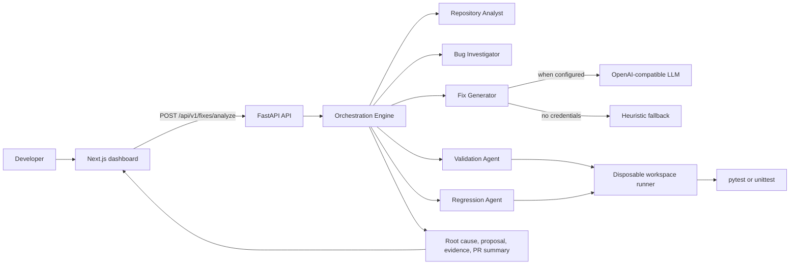

# AutoFix AI Architecture

AutoFix AI is a review-first autonomous bug-fixing prototype. It analyzes a local repository and runs tests in temporary copies; an analysis run never modifies the original repository.

## Component Diagram



## Agent Workflow

```mermaid
sequenceDiagram
    actor Developer
    participant UI as Dashboard
    participant API as FastAPI
    participant O as Orchestrator
    participant A as Agents
    participant S as Disposable Sandbox

    Developer->>UI: Repository path, bug report, test command
    UI->>API: Analyze request and start run
    O->>A: Scan repository and correlate report
    A-->>O: Candidate files and root cause
    O->>A: Generate review-only repair proposal
    A-->>O: Fix narrative and patch preview
    O->>S: Copy repository and run validation tests
    S-->>O: Validation evidence
    O->>S: Make fresh copy and run regression tests
    S-->>O: Regression evidence
    O-->>API: Complete debugging journey
    API-->>UI: Review-ready result; original remains unchanged
```

## Safety Boundary

- `repository_path` must resolve to an existing local directory.
- Only pytest and Python unittest commands are accepted; shell operators are rejected.
- Each test phase copies the repository to an OS temporary directory, applies exact candidate edits only inside that copy, and applies a 60-second timeout.
- Analysis and validation runs are proposals only; they never write a patch or commit.
- `POST /api/v1/fixes/apply-approved` is the sole write path. It requires explicit confirmation, a clean Git worktree, a new `autofix/` branch, and commits only the reviewed candidate edits.

## Package Responsibilities

- `backend/app/api/fixes.py` exposes the bug-fix run API.
- `backend/orchestrator/engine.py` coordinates the five agents and assembles the audit response.
- `backend/agents/workflow_agents.py` provides repository analysis, investigation, and LLM/fallback generation.
- `backend/sandbox/runner.py` runs allow-listed commands in disposable copies.
- `frontend/app/page.tsx` presents submission, journey, evidence, and review outcome.
